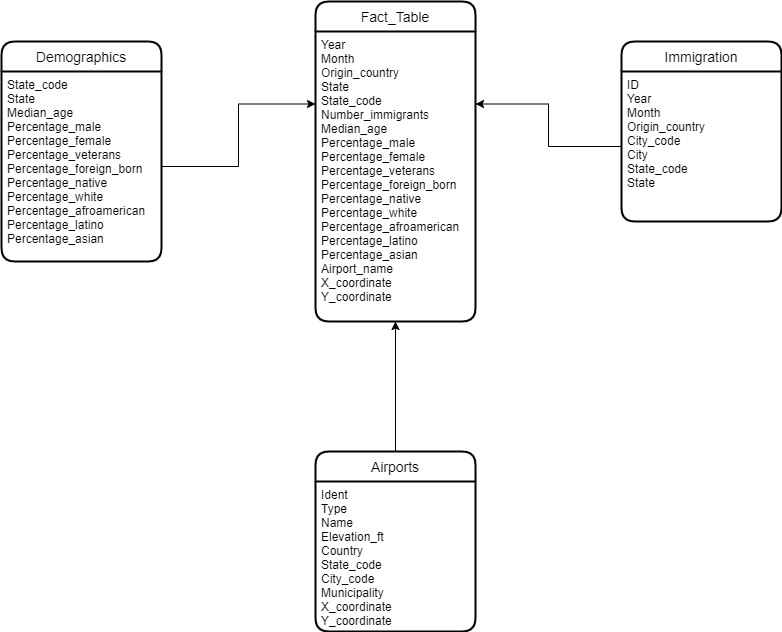

# Data Engineering Capstone Project

## Project Summary
This project aims to be able to answers questions on US immigration such as what are the most popular cities for immigration, 
what is the gender distribution of the immigrants,  
what is the visa type distribution of the immigrants,  
what is the average age per immigrant. 

We design 4 dimension tables:  
demographics,  
immigration, 
airports 
And a single fact table. 
We use Spark for ETL jobs and store the results in parquet for downstream analysis.

## The project follows the follow steps: 
Step 1: Scope the Project and Gather Data 
Step 2: Explore and Assess the Data 
Step 3: Define the Data Model 
Step 4: Run ETL to Model the Data 
Step 5: Complete Project Write Up 

## Data
1. **I94 Immigration Data**: comes from the U.S. National Tourism and Trade Office and contains various statistics on international visitor arrival in USA and comes from the US National Tourism and Trade Office. The dataset contains data from 2016. [link](https://travel.trade.gov/research/reports/i94/historical/2016.html)
2. **World Temperature Data**: comes from Kaggle and contains average weather temperatures by city. [link](https://www.kaggle.com/berkeleyearth/climate-change-earth-surface-temperature-data)
3. **U.S. City Demographic Data**: comes from OpenSoft and contains information about the demographics of all US cities such as average age, male and female population. [link](https://public.opendatasoft.com/explore/dataset/us-cities-demographics/export/)

## Schema for Immigration Analytics

